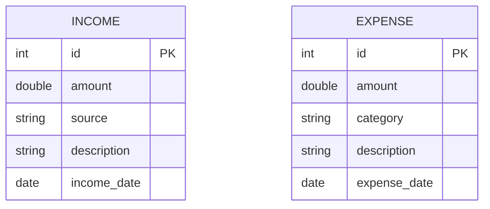

# Monthly Finance Manager

A Java 17 console-based application to track monthly income and expenses using MySQL, JDBC, and clean OOP architecture. The project is designed to be simple, reliable, and production-ready, with proper exception handling and database persistence.


## Features

* Add, view, update, and delete Income records
* Add, view, update, and delete Expense records
* Generate monthly financial reports
* Calculate:

   * Total income
   * Total expenses
   * Monthly savings
* Uses JDBC with PreparedStatements
* Clean separation of concerns (Model / DAO / Service / App)
* Environment-variable based DB configuration

---

## Tech Stack

| Layer        | Technology        |
| ------------ | ----------------- |
| Language     | Java 17           |
| Database     | MySQL             |
| Persistence  | JDBC              |
| Build Tool   | Maven             |
| Architecture | OOP + DAO Pattern |

---

## Project Structure

```text
Monthly-Finance-Manager
├── src/main/java/com/finance
│   ├── app
│   │   └── FinanceApp.java
│   ├── model
│   │   ├── Income.java
│   │   ├── Expense.java
│   │   └── MonthlyReport.java
│   ├── dao
│   │   ├── DBConnection.java
│   │   ├── IncomeDAO.java
│   │   └── ExpenseDAO.java
│   ├── service
│   │   ├── IncomeService.java
│   │   ├── ExpenseService.java
│   │   └── ReportService.java
│   └── exception
│       ├── InvalidAmountException.java
│       └── DatabaseException.java
├── sql
│   └── schema.sql
├── pom.xml
└── README.md
```

---

## Application Architecture (Mermaid Diagram)

```mermaid
graph TD
    A[FinanceApp (Main Menu)] --> B[IncomeService]
    A --> C[ExpenseService]
    A --> D[ReportService]

    B --> E[IncomeDAO]
    C --> F[ExpenseDAO]

    E --> G[(MySQL Database)]
    F --> G

    D --> B
    D --> C
```

---

## Entity Relationship (ER) Diagram



---

## Database Setup (MySQL)

### Create Database and User

Run the following as MySQL root:

```sql
CREATE DATABASE finance_db;

CREATE USER 'finance_user'@'localhost'
IDENTIFIED BY 'finance_password';

GRANT ALL PRIVILEGES ON finance_db.*
TO 'finance_user'@'localhost';

FLUSH PRIVILEGES;
```

---

### Database Schema (sql/schema.sql)

```sql
DROP TABLE IF EXISTS income;
DROP TABLE IF EXISTS expense;

CREATE TABLE income (
  id INT PRIMARY KEY AUTO_INCREMENT,
  amount DOUBLE NOT NULL,
  source VARCHAR(50) NOT NULL,
  description VARCHAR(100),
  income_date DATE NOT NULL
);

CREATE TABLE expense (
  id INT PRIMARY KEY AUTO_INCREMENT,
  amount DOUBLE NOT NULL,
  category VARCHAR(50) NOT NULL,
  description VARCHAR(100),
  expense_date DATE NOT NULL
);
```

---

## Configuration

The application supports environment variable overrides:

```text
FINANCE_DB_URL
FINANCE_DB_USER
FINANCE_DB_PASSWORD
```

Default JDBC URL:

```text
jdbc:mysql://localhost:3306/finance_db
```

---

## Running the Application

Build:

```bash
mvn clean package
```

Run:

```bash
java -jar target/Monthly-Finance-Manager-1.0-SNAPSHOT.jar
```

---

## Sample Console Output

```text
1. Add Income
2. Add Expense
3. View Monthly Report
4. Exit

Total Income  : 50000
Total Expense : 32000
Savings       : 18000
```

---

## Design Principles Used

* Object-Oriented Programming
* DAO Pattern
* Single Responsibility Principle
* Exception-driven validation
* Resource-safe JDBC using try-with-resources

---

## Future Enhancements

* Java Swing or JavaFX UI
* CSV or PDF report export
* Category-wise analytics
* Dockerized MySQL and application
* REST API using Spring Boot

---

## Author

Built for learning real-world Java and JDBC application design with clean architecture and database persistence.

---

Production-ready and interview-ready project.
